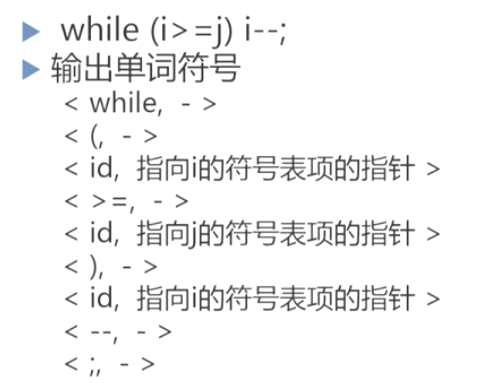
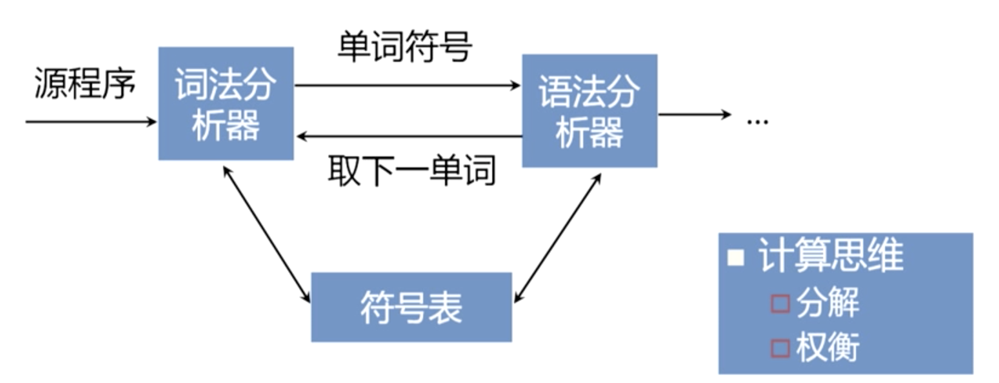
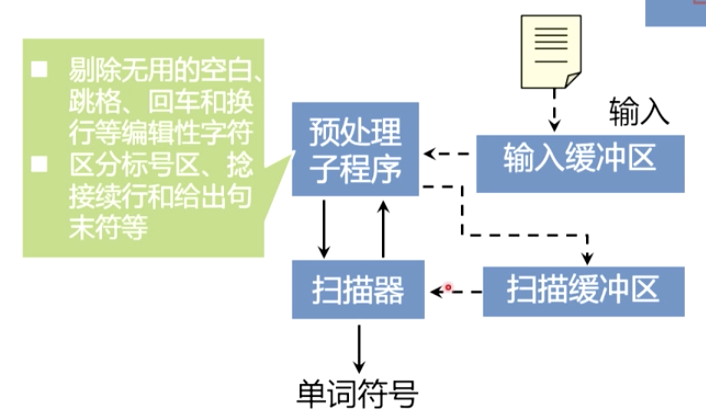
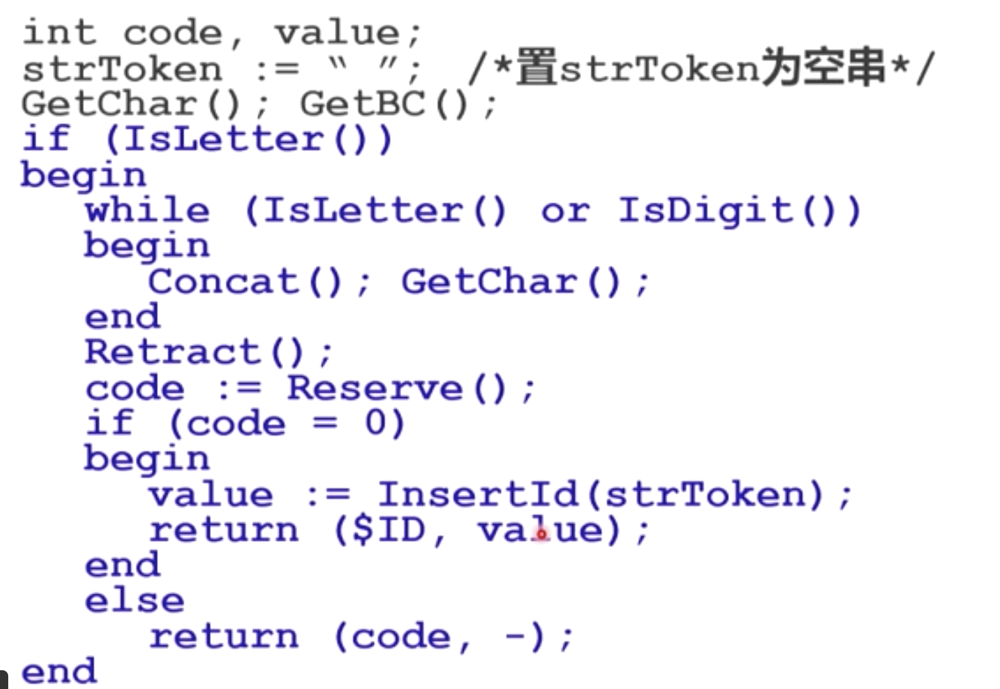

[TOC]

# 词法分析

* 词法分析器的功能
  * 输入源程序，输出单词符号
* 词法分析器的设计
  * 给出程序设计语言的单词规范-单词表
  * 对照单词表设计识别该语言所有单词的状态转换图
  * 根据状态转换图编写词法分析程序

## 词法分析器的设计

* 词法分析的任务

  从左至右逐个字符的对源程序进行扫描，产生一个个单词符号

* 词法分析器(Lexical Analyzer)

  * 扫描器(Scanner)
  * 执行词法分析的程序

* 功能

  * 输入源程序，输出单词符号

* 单词符号的种类

  * 基本字：如begin，repeat，for,...
  * 标识符：用户自定义的，用来表示变量名，数组名，过程名等
  * 常数：各种类型的数值
  * 云算法：+,-,*,/..
  * 界符：逗号，分号，括号和空白等

* 输出的单词符号的表示形式

  * (单词种别，单词自身的值)

* 单词种别通常用整数编码表示

  * 若一个种别只有一个单词符号，则种别编码就代表该单词符号，假定基本字，运算符合界符都是一符一种
  * 若一个种别有多个单词符号，则对于每个单词符号，给出种别的编码和自身的值
    * **标识符**单列一种，标识符自身的值表示成按机器字节码划分的内部码
    * 常数按类型分种，常数的值表示成标准的二进制形式

* 程序示例

  

* 词法分析作为一个独立的阶段

  * 结构清晰简洁，有利于集中考虑词法分析一些枝节问题

  * 但不一定不作为单独的一遍

    * 将其处理为一个子程序

  * 语法分析器在编译器中的地位

    

    如果把各阶段都实现为独立的一遍的话，会导致编译程序频繁进行文件的输入输出，从文件中读入上一遍的处理结果，把当前遍的结果写入文件，这样一来，效率很低，这样可以减少多遍扫描带来的输入输出开销，提高编译程序的效率

## 词法分析器的结构

## 扫描缓冲区

存在的问题：缓冲区中只是读取到了单词的部分

 解决的方式：两个半区的互补使用

如果先使用的是右半区

## 状态转换图

状态转换图是一张有限方向图

* 节点代表状态，用圆圈白鸥是

* 状态之间用**箭头符号**表示，箭头符号上的标记(字符)代表射出节点状态下可能出现的输入字符或字符类

* 一张状态转换图只包含有限个状态，其中有一个为初态，至少要有一个终态

  

* 状态转换图可用于识别(或接受)一定的字符串

  若存在一条从初态到某一终态的道路，且这条路上所有弧上的标记符连接成的字等于a,则称a为被该状态转换图所识别(接受)

* example:识别由数字字符构成的任意串

  

  >  星号表示最后面读入的一个符号，不属于刚才读入的单词，要把它退回去

## 词法分析器的设计示例

* 单词表

  

* 设计状态转换图

  

* 状态转换图的实现

  * 不含回路的分叉节点：可用一个 CASE 语句或一组 IF-THEN-ELSE 的语句实现

    

  * 含回路的状态节点：对应一段由 WHILE 结构和 IF 语句构成的程序

     

    

  * 终态节点：表示识别出某种单词符号，对应返回语句

    

  * 全局变量与过程

    * ch 字符变量，存放最新读入的源程序字符
    * strToken字符数组，存放构成单词符号的字符串
    * GetChar：子程序过程，把下一个字符读入到ch中
    * GetBC子程序过程，跳过空白符，直至ch中读入一非空白符
    * Concat子程序，把ch中的字符连接到strToken中
    * IsLetter和IsDisgital布尔函数，判断ch中的字符是否为数字和字母
    * Reserve整型函数，用于strToken中的字符串查找保留字表，若他是保留字则给出他的编码，否则返回0
    * Retract子程序，把搜索指针回调一个字符位置
    * InsertId 整型函数，将strToken中的标识符插入符号表，返回符号表指针
    * InsertConst整型函数过程，将strToken中的常数插入常数表，返回常数表指针

  * 词法分析器的实现

    

     

    

    

    

## 状态转换图的代码一般化

* 变量curState用于保存现有的状态

* 用二维数组表示状态图：stateTrans[state]\[ch]

  * State:表示给定状态state
  * ch：表示输入的符号
  * 二位数组的值为后继状态

  

*部分内容整理自:中国大学MOOC-[国防科技大学《编译原理》](https://www.icourse163.org/course/NUDT-1003101005)PPT*

