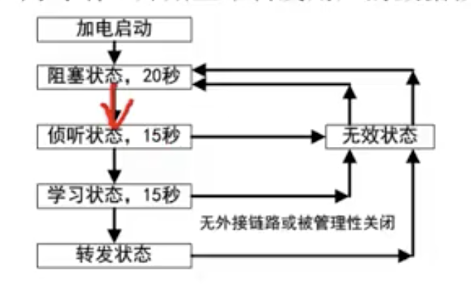
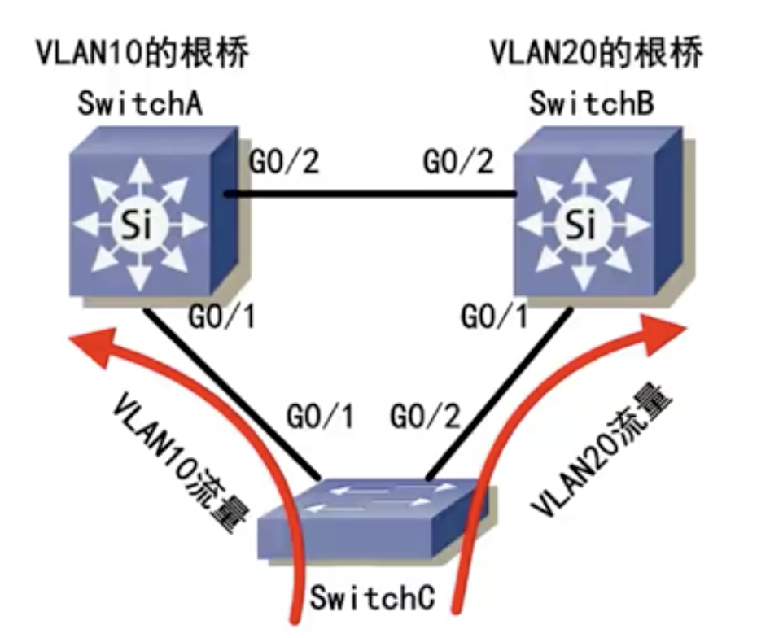
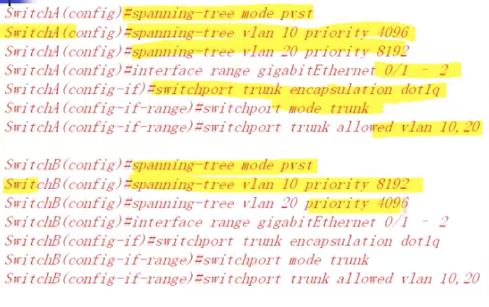
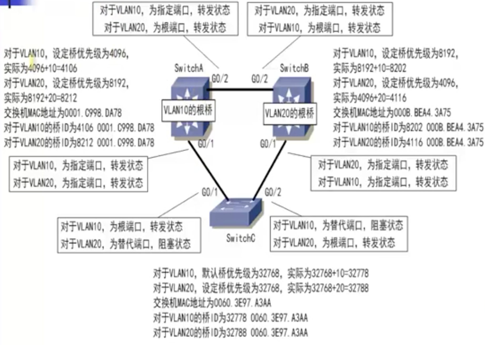
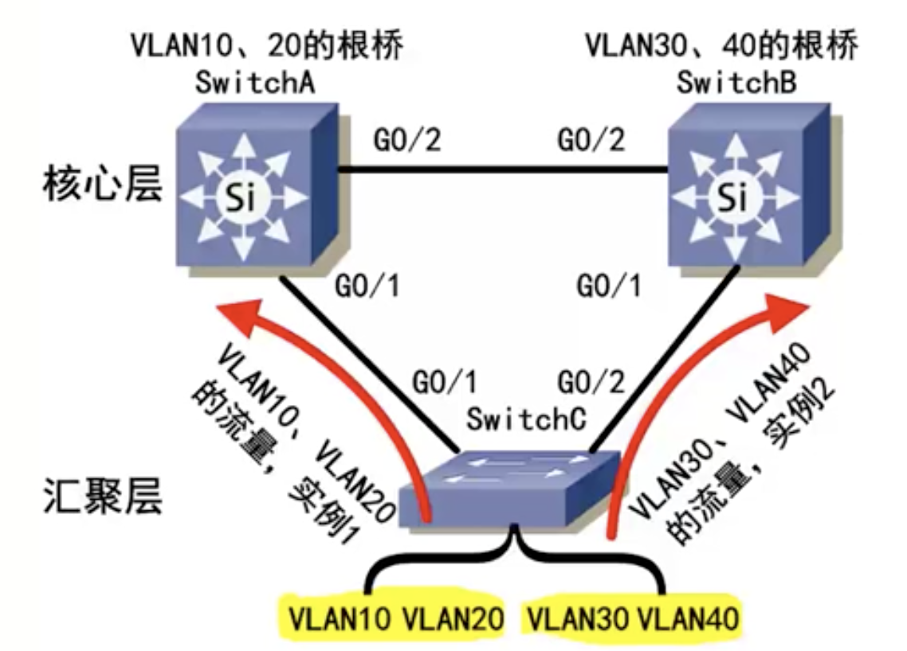
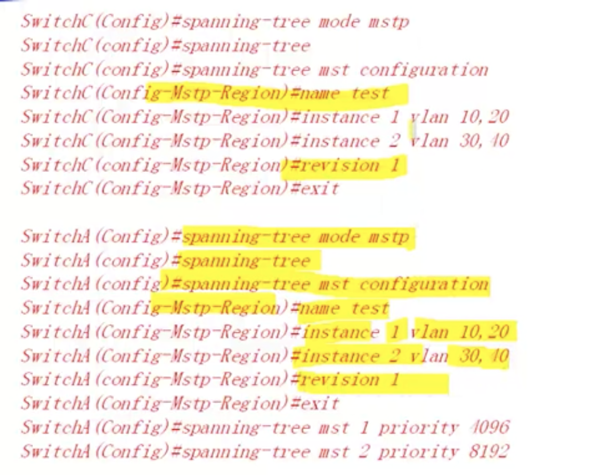
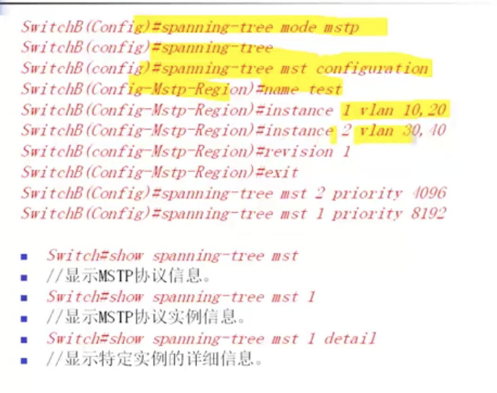

[TOC]

# 冗余链路

采用冗余拓扑结构保证了设备及链路故障时提供备份，从而不影响正常通信

存在桥接环路问题，桥接环路主要会产生广播风暴，单帧多次递交，MAC地址表失效等危害

# 生成树协议

生成树协议（spanning Tree Protocol, STP)是一个第二层数据链路层的管理协议，IEEE802委员会制定的生成树协议规范为802.1d,其目的是**将一个存在桥接环路的物理网络变成一个没有环路的逻辑树形网络**

* BPDU

  桥接协议数据单元

  在STP的工作过程中，交换机之间通过相互传递桥接协议数据单元BPDU获取各台交换机的参数信息，进而相互通信协商，将一个存在桥接环路的物理网络形成一个树形结构的逻辑网络

  

  

## STP的工作过程

* 选择根桥

  原则上所有交换机中桥ID（Bridge ID）最小的交换机作为生成树的根桥，桥ID是8个字节，包含了2个字节的桥优先级和6个字节的交换机MAC地址，在默认情况下，桥优先级都是32768，BPDU每隔2秒发送一次，桥ID最小的交换机将被选举为根桥

  

  **降低优先级可以指定根桥**

* 选择根端口

  原则是每台交换机的所有端口中，**到达根桥所花费的路径开销值最小的端口被确定为该交换机的根端口**

  

  

* 选择指定端口

  原则是每个网段中的所有端口中，到达根桥所花费的路径开销值为最小的端口被确定为该网段的指定端口

  

* 决定非指定端口

  既不是根端口，也不是指定端口的端口将成为非指定端口
  
  

## STP交换机端口的状态

* 阻塞状态：当交换机启动的时候，其所有的端口都处于阻塞状态以防止出现环路，**处于阻塞状态的端口可以发送和接收BPDU**，但不能发送任何用户数据帧，此状态持续20秒

* 侦听状态：在侦听状态下，交换机间继续收发BPDU，仍不能发送任何用户数据帧，**在这个状态下，交换机间交换BPDU来决定根桥，决定根端口和指定端口**，此状态会持续15秒

* 学习状态：在学习状态下，交换机开始接受用户数据帧，并根据用户数据帧里的源MAC地址**建立交换机的MAC地址表，但是仍然不能转发用户数据帧**，此状态会持续15秒

* 转发状态：**在转发状态下，交换机不但能学习数据帧中的源MAC地址，同时端口开始正常转发用户的数据帧**

  

* 收敛时间：当拓扑结构发生变化后而引起的生成树重新计算，从而使得网络重新由不稳定状态进入到稳定状态，这个过程称之为生成树的收敛，在STP中，这样的收敛时间需要30-50秒

## RSTP

由于STP的收敛过程需要30-50秒，为了适应现代网络的需求，针对**传统的STP收敛慢这一弱点**，IEEE指定了标准的802.1w协议，他使得收敛时间得以在1秒到10秒之中完成，所以IEEE802.1w又被称之为快速生成树协议（Rapid Spanning Tree Protocol, RSTP)

* RSTP端口的角色

  根端口，指定端口，替代端口（根端口的后备），备份端口（指定端口的后备），禁用端口

* RSTP端口的状态

  

STP和RSTP的缺点

1. 在STP和RSTP中，由于整个交换网络只有一颗生成树，在网络规模比较大的时候会导致较长的收敛时间
2. STP和RSTP都与VLAN技术存在不兼容的问题，无法在虚拟的VLAN中生成树
3. 在STP和RSTP中，当链路被阻塞后将不会承载任何流量，这样会造成带宽的极大浪费

## PVST

**思科专有的PVST/PSVT+**

Cisco的每VLAN生成树（Per VLAN Spanning Tree)，就是针对每个VLAN都生成一棵树，他能够保证每一个VLAN都不存在环路

缺点：

1. PVST+的BPDU通信量将正比于VLAN个数
2. 在VLAN个数比较多的时候，维护多棵树的计算量和资源占用量将急剧增长
3. 由于协议的私有性，难以普及

* PVST+配置和结果验证

  

  

## MSTP

多生成树协议(Multiple Spanning Tree Protocol，MSTP)是IEEE802.1s中定义的一种新型多实例化生成树协议

**MSTP定义了“实例”（Instance）的概念，简单的说，STP/RSTP是基于端口的，PVST/PVST+是基于VLAN的，而MSTP就是基于实例的**

所谓实例就是多个VLAN的一个集合，通过采用多个VLAN捆绑到一个实例中的方法，可以节省通信开销和资源占用率

配置

