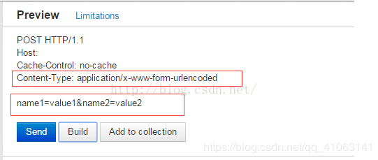

[toc]

转自：https://blog.csdn.net/qq_41063141/article/details/101505956

**1、multipart/form-data**

以表单形式提交，主要是上传文件用它，在http中格式为

 

 

 

 

 **2、application/x-www-from-urlencoded**

以键值对的数据格式提交，当action为post时，浏览器将form数据封装到http body中，然后发送server。这个格式不能提交文件

 

 

 

 

 

 **3、raw 可以上传任意格式的文本，**

选择text，则请求头是：text/plain

选择JavaScript，则请求头是：application/javascript

选择json，则请求头是：application/json(如果想以json格式传参，就用raw+json就行了)

选择HTML，则请求头是：text/html

选择application/xml，则请求头是：application/xml

 

 

**4、binary**

相当于Content-Type:application/octet-stream,从字面意思得知，只可以上传二进制数据，通常用来上传文件，由于没有键值，所以，一次只能上传一个文件。（一般用的不多）

 

 **5、postman中Params和Body的区别**

Params它会将参数放入url的？后面提交到后台（带到请求的接口链接里），用于Get请求。

 

 Body是放在请求体里面，用于Post请求

 