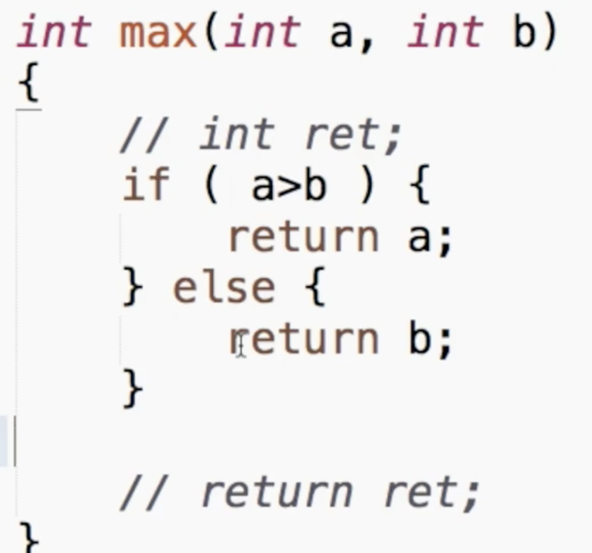
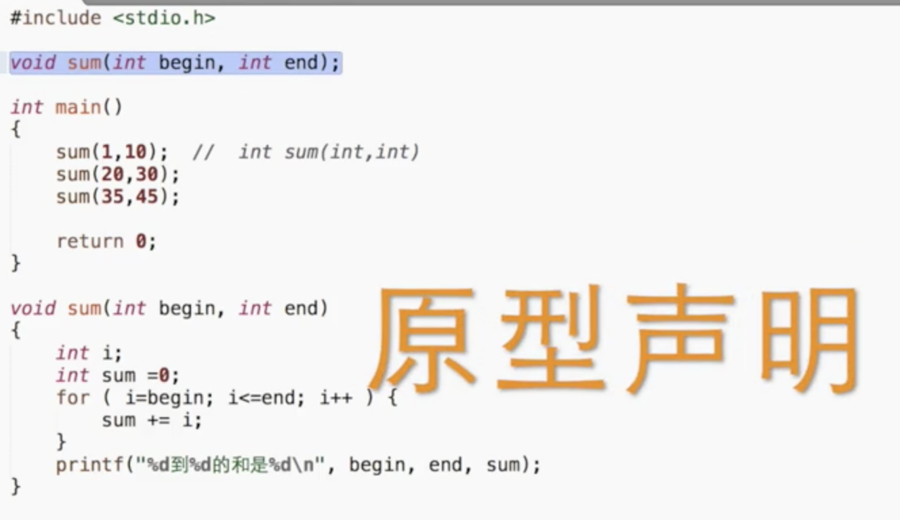
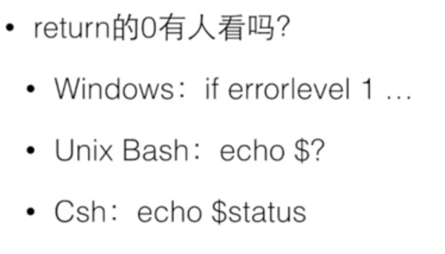
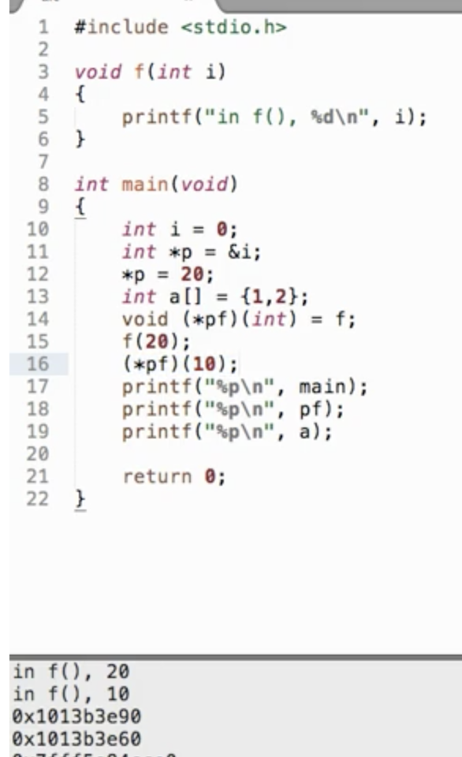
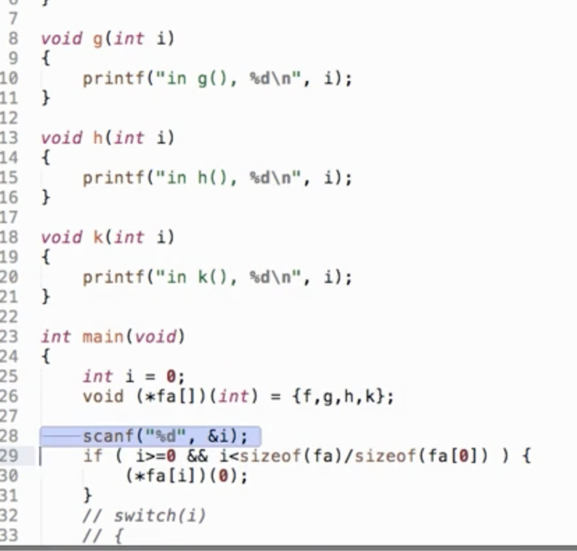
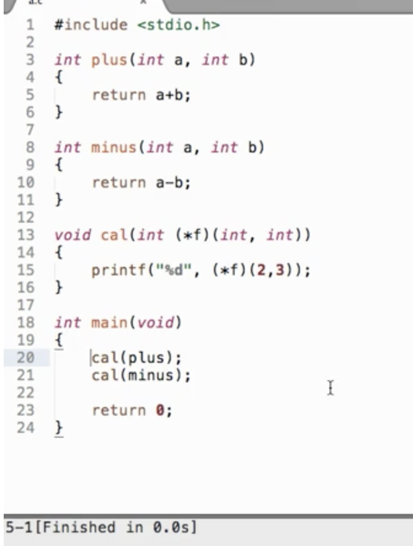

[TOC]

# 函数

- 单一出口

如果我们像下面这样写，就不符合单一出口的理念



- 函数的先后关系

  C的编译器自上而下顺序分析你的代码，所以**要么将你的声明放在使用的前面(推荐)，要么将整个函数放在前面**

  

- 函数原型

  将函数的头取出加上分号即可

  - 名称
  - 参数(数量及类型，可以不写参数的名字，但是建议留下名字)
  - 返回类型

- 传值

  **每个函数有自己的变量空间，**参数也位于这个独立的空间中，和其他函数没有关系

- 没有参数时

  

  建议，如果没有参数的时候，使用void f(void);用于特别指明

  C语言不允许函数嵌套定义

- main函数

  其中main函数是程序的入口，main函数也是提供给别人调用的，所以我们看到main函数也是有返回值的

  

* 函数的地址

  ```c
  void f(void){
    printf("sout f()\n");
  }
  
  int main(void){
    int i = 0;
    int *p = &i;
   	*p = 20;
    
    void (*pf)(void) = f;
    
    //调用函数
    (*pf)()；
  }
  ```

  我们也可以在调用的时候传值

  


* 函数指针

  当我们需要执行的函数不确定的时候，我们可以这么做

  

  