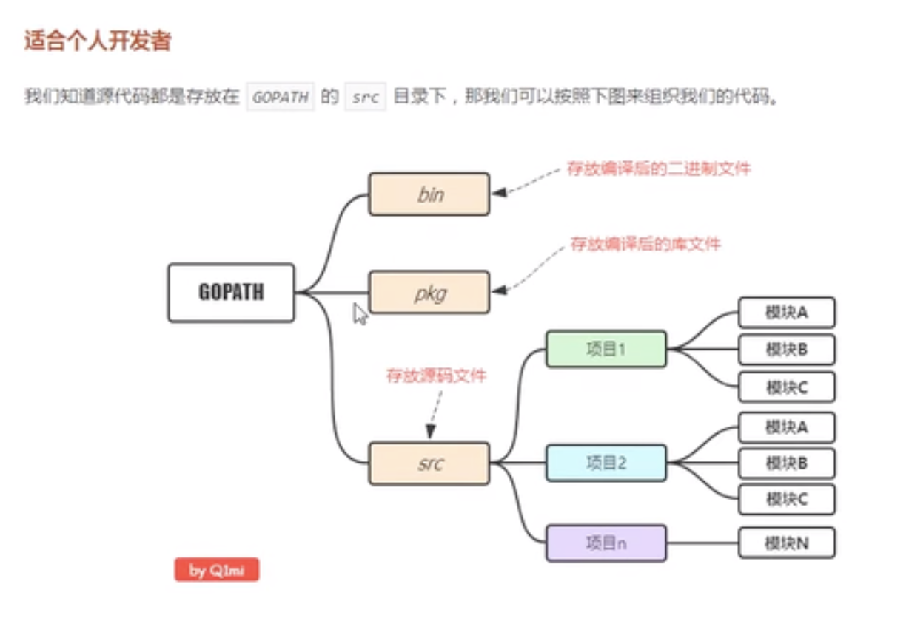
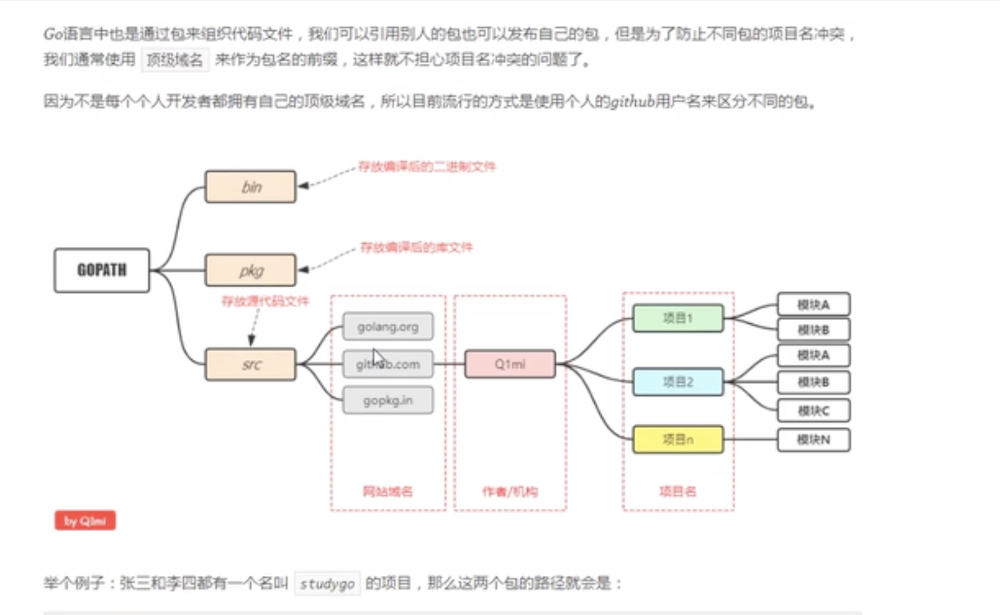
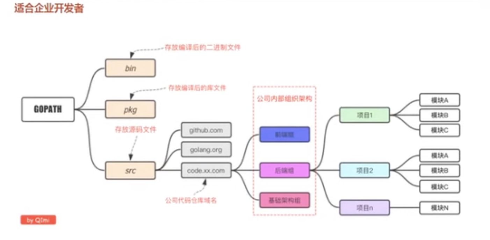

[toc]

# go工程目录及环境变量

GOPATH是一个环境变量，用来标明你写的go项目的存放路径（工作目录），需要将这个存入环境变量

go语言的项目，需要特定的目录结构进行管理，一个标准的go工程需要有如下的三个目录：使用一个名为GOPATH的环境变量来指定:

* src
  放我们自己的源代码
* bin
  编译之后的程序，使用标准命令go install之后存放的位置
* pkg
  缓存包

GOROOT存放go语言的标准库



1. 在自己的电脑上新建一个目录D:\go (用于存放我们编写的Go语言代码)
2. 在环境变量里，新建一项：GOPATH：D:\go
3. 在D:\go目录下新建：bin, sr, pkg
4. 把D:\go\bin这个目录添加到PATH这个环境变量的后面
5. 你的电脑上默认是有一个GOPATH，需要把这个替换成上面的值







# helloworld

```go

//每个go都必须有一个包名
//每个go程序都是.go结尾的
package main

//这是导入一个标准包，format，一般用于格式化的输出
import "fmt"


// 一个函数的返回值不会放在func前面，而是放在参数列表后面
// 函数左花括号必须与函数名同行，不能写在下一行
func main(){

	// go语言的语句不需要;结尾
	fmt.Println("hello, world!")
}
```


# go语言的特点

1. 没有头文件的概念，.go走天下

2. 强类型的语言，编译性语言（不是解释型）

3. 一个go语言的应用程序，**在运行的时候是不需要依赖外部库的**，把执行时需要的所有的库打包到程序中（go语言的程序包比较大）

4. 只要引用了import的头文件，程序中必须使用，否则编译不过

5. go语法是不区分平台的（相比较C语言是需要在特定的平台下编译运行），即在Windows下编译的go程序是可以在Linux下运行

   1. GOOS:可以设定运行的平台
      1. mac: darwin
      2. linux:linux
      3. windows:windows
   2. GOARCH:目标平台的体系架构
      1. 386：GOARCH=386
      2. amd64:GOARCH=amd64
      3. arm:GOARCH=arm
   3. 查看当前go的环境变量：go env

   ```shell
    ~  go env                                                       ok | 19:52:43
   GO111MODULE=""
   GOARCH="amd64"
   GOBIN=""
   GOCACHE="/Users/chenyansong/Library/Caches/go-build"
   GOENV="/Users/chenyansong/Library/Application Support/go/env"
   GOEXE=""
   GOFLAGS=""
   GOHOSTARCH="amd64"
   GOHOSTOS="darwin"
   GOINSECURE=""
   GOMODCACHE="/Users/chenyansong/go/pkg/mod"
   GONOPROXY=""
   GONOSUMDB=""
   GOOS="darwin"
   GOPATH="/Users/chenyansong/go"
   GOPRIVATE=""
   GOPROXY="https://proxy.golang.org,direct"
   GOROOT="/usr/local/go"
   GOSUMDB="sum.golang.org"
   GOTMPDIR=""
   GOTOOLDIR="/usr/local/go/pkg/tool/darwin_amd64"
   GOVCS=""
   GOVERSION="go1.16.3"
   GCCGO="gccgo"
   AR="ar"
   CC="clang"
   CXX="clang++"
   CGO_ENABLED="1"
   GOMOD="/dev/null"
   CGO_CFLAGS="-g -O2"
   CGO_CPPFLAGS=""
   CGO_CXXFLAGS="-g -O2"
   CGO_FFLAGS="-g -O2"
   CGO_LDFLAGS="-g -O2"
   PKG_CONFIG="pkg-config"
   GOGCCFLAGS="-fPIC -arch x86_64 -m64 -pthread -fno-caret-diagnostics -Qunused-arguments -fmessage-length=0 -fdebug-prefix-map=/var/folders/bx/_yxq3xys79d7tk10_qp5qk5w0000gn/T/go-build3164225615=/tmp/go-build -gno-record-gcc-switches -fno-common"
    ~
   ```

   

# go command line

```shell
# 编译: -o 指定生成文件的名字
go build -o hello.exe hello.go


# 编译其他的平台
GOOS=linux
GOARCH=amd64
go build -o hello  hello.go

#直接运行程序，不会生成编译后的文件
go run *.go

#安装程序，拿到一个C源码，想要自己编译出EXE，如下：
./configure
make
make install  //将编译好的程序安装到指定的目录，比如/usr/bin

GOBIN=~/Desktop/go_workspace/bin
go install //安装到上面的目录下面去

```


