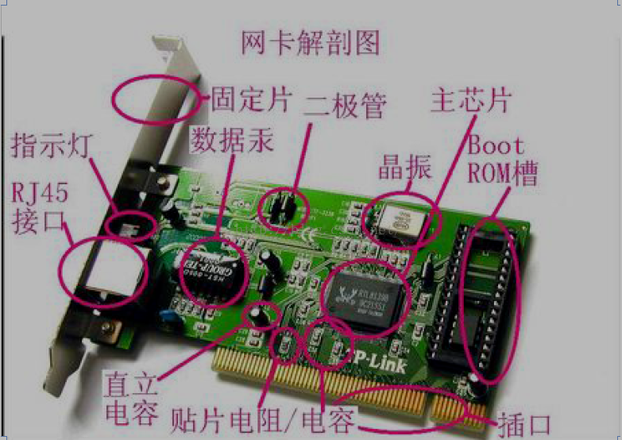
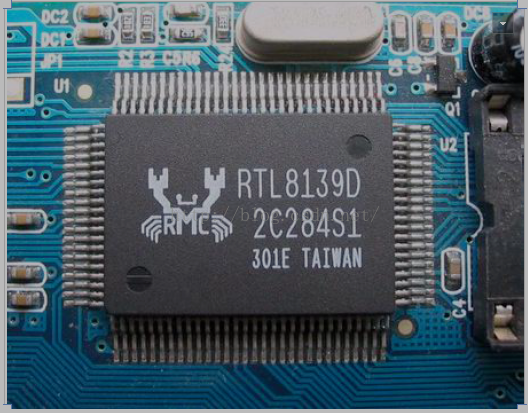
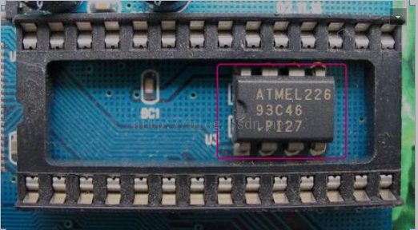
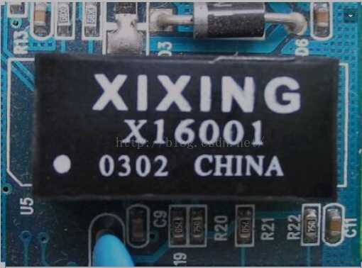
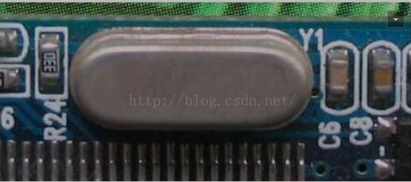
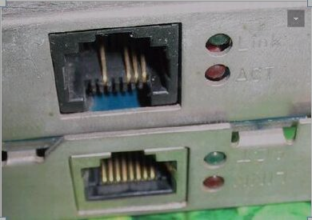

[toc]

转自：https://www.geek-share.com/detail/2706766517.html

# 一，认识网卡

​    网卡(Network Interface Card，简称NIC)，也称网络适配器，是电脑与局域网相互连接的设备。无论是普通电脑还是高端服务器，只要连接到局域网，就都需要安装一块网卡。如果有必要，一台电脑也可以同时安装两块或多块网卡。

   一块网卡包括OSI 模型的两个层，物理层和数据链路层：
   1》物理层定义了数据传送与接收所需要的电与光信号、线路状态、时钟基准、数据编码和电路等，并向数据链路层设备提供标准接口。
   2》数据链路层则提供寻址机构、数据帧的构建、数据差错检查、传送控制、向网络层提供标准的数据接口等功能。

# 二：网卡的组要作用

​    网卡的功能主要有两个:
​    一是将电脑的数据封装为帧，并通过网线(对无线网络来说就是电磁波)将数据发送到网络上去;
​    二是接收网络上其它设备传过来的帧，并将帧重新组合成数据，发送到所在的电脑中。
​    网卡能接收所有在网络上传输的信号，但正常情况下只接受发送到该电脑的帧和广播帧，将其余的帧丢弃。然后，传送到系统CPU 做进一步处理。当电脑发送数据时，网卡等待合适的时间将分组插入到数据流中。接收系统通知电脑消息是否完整地到达，如果出现问题，将要求对方重新发送。

# 三：网卡的组成和工作原理

​    以最常见的PCI接口的网卡为例：

​	

 网卡的组成：
    （1）主芯片：网卡的主控制芯片是网卡的核心元件，一块网卡性能的好坏和功能的强弱多寡，主要就是看这块芯片的质量。如下图所示：

（2）BOOTROM槽：BOOTROM 插座也就是常说的无盘启动ROM 接口，其是用来通过远程启动服务构造无盘工作站的。如下图所示：

（3）数据泵：作用一是传输数据；二是隔离网线连接的不同网络设备间的不同电平，还能对设备起到一定的防雷保护作用。如下图所示：

（4）晶振即石英振荡器，提供基准频率,如下图所示：

（5）LED指示灯：用来标识网卡的不同工作状态，例如，Link/Act表示连接活动状态，Full表示是否全双工，而Power是电源指示。
（6）网线接口：有BNC接口和RJ-45接口，目前主要使用8芯线的RJ-45接口。

（7）总线接口：用于网卡与电脑相连接，内置式网卡需要通过俗称“金手指”的总线接口插在计算机主板的扩展槽中。主要有ISA,PCI,PCMCIA和USB等常见的是PCI总线接口的网卡。

# 四：网卡的工作原理

网卡充当计算机和网络缆线之间的物理接口或连线，负责将计算机中的数字信号转换成电或光信号。
网卡要承担串行数据或并行数据间的转换，数据在计算机总线中并行传输，而在网络的物理缆线中以串行的比特流传输。
以太网卡中数据链路层的芯片一般简称之为 MAC 控制器，物理层的芯片我们简称之为PHY。许多网卡的芯片把MAC 和PHY 的功能做到了一颗芯片中，比如Intel 82559 网卡的和3COM 3C905 网卡。但是MAC 和PHY 的机制还是单独存在的，只是外观的表现形式是一颗单芯片。当然也有很多网卡的MAC 和PHY 是分开做的，比如D-LINK 的DFE-530TX等。

## 1 数据链路层MAC 控制器

首先我们来说说以太网卡的 MAC 芯片的功能。以太网数据链路层其实包含MAC（介质访问控制）子层和LLC（逻辑链路控制）子层。一块以太网卡MAC 芯片的作用不但要实现MAC 子层和LLC 子层的功能，还要提供符合规范的PCI 界面以实现和主机的数据交换。MAC 从PCI 总线收到IP 数据包（或者其他网络层协议的数据包）后，将之拆分并重新打包成最大1518Byte，最小64Byte 的
4000
帧。这个帧里面包括了目标MAC 地址、自己的源MAC 地址和数据包里面的协议类型（比如IP 数据包的类型用80 表示）。最后还有一个DWORD(4Byte)的CRC 码。可是目标的 MAC 地址是哪里来的呢？这牵扯到一个ARP 协议（介乎于网络层和数据链路层的一个协议）。第一次传送某个目的IP 地址的数据的时候，先会发出一个ARP 包，其MAC 的目标地址是广播地址，里面说到："谁是xxx.xxx.xxx.xxx 这个IP 地址的主人？"因为是广播包，所有这个局域网的主机都收到了这个ARP 请求。收到请求的主机将这个IP地址和自己的相比较，如果不相同就不予理会，如果相同就发出ARP 响应包。这个IP 地址的主机收到这个ARP 请求包后回复的ARP 响应里说到："我是这个IP 地址的主人"。这个包里面就包括了他的MAC 地址。以后的给这个IP 地址的帧的目标MAC 地址就被确定了。（其它的协议如IPX/SPX 也有相应的协议完成这些操作。）IP 地址和MAC 地址之间的关联关系保存在主机系统里面，叫做ARP 表，由驱动程序和操作系统完成。在Microsoft 的系统里面可以用 arp -a 的命令查看ARP 表。收到数据帧的时候也是一样，做完CRC 以后，如果没有CRC 效验错误，就把帧头去掉，把数据包拿出来通过标准的借口传递给驱动和上层的协议客栈，最终正确的达到我们的应用程序。还有一些控制帧，例如流控帧也需要MAC 直接识别并执行相应的行为。以太网MAC芯片的一端接计算机PCI 总线，另外一端就接到PHY 芯片上。以太网的物理层又包括MII/GMII（介质独立接口）子层、PCS（物理编码子层）、PMA（物理介质附加）子层、PMD（物理介质相关）子层、MDI 子层。而PHY 芯片是实现物理层的重要功能器件之一，实现了前面物理层的所有的子层的功能。

## 2 物理层PHY

PHY 在发送数据的时候，收到MAC 过来的数据（对PHY 来说，没有帧的概念，对它来说，都是数据而不管什么地址，数据还是CRC），每4bit 就增加1bit 的检错码，然后把并行数据转化为串行流数据，再按照物理层的编码规则（10Based-T 的NRZ 编码或100based-T的曼彻斯特编码）把数据编码，再变为模拟信号把数据送出去。（注：关于网线上数据是数字的还是模拟的比较不容易理解清楚。最后我再说）收数据时的流程反之。发送数据时，PHY 还有个重要的功能就是实现CSMA/CD 的部分功能，它可以检测到网络上是否有数据在传送。网卡首先侦听介质上是否有载波（载波由电压指示），如果有，则认为其他站点正在传送信息，继续侦听介质。一旦通信介质在一定时间段内（称为帧间缝隙IFG= 9.6 微秒）是安静的，即没有被其他站点占用，则开始进行帧数据发送，同时继续侦听通信介质，以检测冲突。在发送数据期间，如果检测到冲突，则立即停止该次发送，并向介质发送一个“阻塞”信号，告知其他站点已经发生冲突，从而丢弃那些可能一直在接收的受到损坏的帧数据，并等待一段随机时间（CSMA/CD 确定等待时间的算法是二进制指数退避算法）。在等待一段随机时间后，再进行新的发送。如果重传多次后（大于16 次）仍发生冲突，就放弃发送。接收时，网卡浏览介质上传输的每个帧，如果其长度小于64 字节，则认为是冲突碎片。如果接收到的帧不是冲突碎片且目的地址是本地地址，则对帧进行完整性校验，如果帧长度大于1518 字节（称为超长帧，可能由错误的LAN 驱动程序或干扰造成）或未能通过CRC校验，则认为该帧发生了畸变。通过校验的帧被认为是有效的，网卡将它接收下来进行本地处理许多网友在接入 Internt 宽带时，喜欢使用"抢线"强的网卡，就是因为不同的PHY 碰撞后计算随机时间的方法设计上不同，使得有些网卡比较"占便宜"。不过，抢线只对广播域的网络而言的，对于交换网络和ADSL 这样点到点连接到局端设备的接入方式没什么意义。而且"抢线"也只是相对而言的，不会有质的变化。

## 3 关于网络间的冲突

现在交换机的普及使得交换网络的普及，使得冲突域网络少了很多，极大地提高了网络的带宽。但是如果用HUB，或者共享带宽接入Internet 的时候还是属于冲突域网络，有冲突碰撞的。交换机和HUB 最大的区别就是：一个是构建点到点网络的局域网交换设备，一个是构建冲突域网络的局域网互连设备。我们的 PHY 还提供了和对端设备连接的重要功能并通过LED 灯显示出自己目前的连接的状态和工作状态让我们知道。当我们给网卡接入网线的时候，PHY 不断发出的脉冲信号检测到对端有设备，它们通过标准的"语言"交流，互相协商并却定连接速度、双工模式、是否采用流控等。通常情况下，协商的结果是两个设备中能同时支持的最大速度和最好的双工模式。这个技术被称为Auto Negotiation 或者NWAY，它们是一个意思--自动协商。

## 4 PHY 的输出部分

现在来了解 PHY 的输出后面部分。一颗CMOS 制程的芯片工作的时候产生的信号电平总是大于0V 的（这取决于芯片的制程和设计需求），但是这样的信号送到100 米甚至更长的地方会有很大的直流分量的损失。而且如果外部网现直接和芯片相连的话，电磁感应（打雷）和静电，很容易造成芯片的损坏。再就是设备接地方法不同，电网环境不同会导致双方的0V 电平不一致，这样信号从A传到B，由于A 设备的0V 电平和B 点的0V 电平不一样，这样会导致很大的电流从电势高的设备流向电势低的设备。我们如何解决这个问题呢？这时就出现了 Transformer（隔离变压器）这个器件。它把PHY 送出来的差分信号用差模耦合的线圈耦合滤波以增强信号，并且通过电磁场的转换耦合到连接网线的另外一端。这样不但使网线和PHY 之间没有物理上的连接而换传递了信号，隔断了信号中的直流分量，还可以在不同0V 电平的设备中传送数据。隔离变压器本身就是设计为耐 2KV~3KV 的电压的。也起到了防雷感应（我个人认为这里用防雷击不合适）保护的作用。有些朋友的网络设备在雷雨天气时容易被烧坏，大都是PCB 设计不合理造成的，而且大都烧毁了设备的接口，很少有芯片被烧毁的，就是隔离变压器起到了保护作用。

## 5 关于传输介质

隔离变压器本身是个被动元件，只是把PHY 的信号耦合了到网线上，并没有起到功率放大的作用。那么一张网卡信号的传输的最长距离是谁决定的呢？一张网卡的传输最大距离和与对端设备连接的兼容性主要是 PHY 决定的。但是可以将信号送的超过100 米的PHY 其输出的功率也比较大，更容易产生EMI 的问题。这时候就需要合适的Transformer 与之配合。作PHY 的老大公司Marvell 的PHY，常常可以传送180~200米的距离，远远超过IEEE 的100 米的标准。RJ-45 的接头实现了网卡和网线的连接。它里面有8 个铜片可以和网线中的4 对双绞（8根）线对应连接。其中100M 的网络中1、2 是传送数据的，3、6 是接收数据的。1、2 之间
是一对差分信号，也就是说它们的波形一样，但是相位相差180 度，同一时刻的电压幅度互为正负。这样的信号可以传递的更远，抗干扰能力强。同样的，3、6 也一样是差分信号。网线中的 8 根线，每两根扭在一起成为一对。我们制作网线的时候，一定要注意要让1、2 在其中的一对，3、6 在一对。否则长距离情况下使用这根网线的时候会导致无法连接或连接很不稳定。现在新的 PHY 支持AUTO MDI-X 功能(也需要Transformer 支持)。它可以实现RJ-45接口的1、2 上的传送信号线和3、6 上的接收信号线的功能自动互相交换。有的PHY 甚至支持一对线中的正信号和负信号的功能自动交换。这样我们就不必为了到底连接某个设备需要使用直通网线还是交叉网线而费心了。这项技术已经被广泛的应用在交换机和SOHO 路由器上。在 1000Basd-T 网络中，其中最普遍的一种传输方式是使用网线中所有的4 对双绞线，其中增加了4、5 和7、8 来共同传送接收数据。由于1000Based-T 网络的规范包含了AUTOMDI-X 功能，因此不能严格确定它们的传出或接收的关系，要看双方的具体的协商结果。

## 6 PHY 和MAC 之间如何进行沟通

下面继续让我们来关心一下 PHY 和MAC 之间是如何传送数据和相互沟通的。通过IEEE 定义的标准的MII/GigaMII（Media Independed Interfade，介质独立界面）界面连接MAC和PHY。这个界面是IEEE 定义的。MII 界面传递了网络的所有数据和数据的控制。而 MAC 对PHY 的工作状态的确定和对PHY 的控制则是使用SMI（Serial ManagementInterface）界面通过读写PHY 的寄存器来完成的。PHY 里面的部分寄存器也是IEEE 定义的，这样PHY 把自己的目前的状态反映到寄存器里面，MAC 通过SMI 总线不断的读取PHY 的状态寄存器以得知目前PHY 的状态，例如连接速度，双工的能力等。当然也可以通过SMI设置PHY 的寄存器达到控制的目的，例如流控的打开关闭，自协商模式还是强制模式等。我们看到了，不论是物理连接的 MII 界面和SMI 总线还是PHY 的状态寄存器和控制寄存器都是有IEEE 的规范的，因此不同公司的MAC 和PHY 一样可以协调工作。当然为了配合不同公司的PHY 的自己特有的一些功能，驱动需要做相应的修改。

## 7 网卡的供电

最后就是电源部分了。大多数网卡现在都使用 3.3V 或更低的电压。有的是双电压的。因此需要电源转换电路。而且网卡为了实现 Wake on line 功能，必须保证全部的PHY 和MAC 的极少一部分始终处于有电的状态，这需要把主板上的5V Standby 电压转换为PHY 工作电压的电路。在主机开机后，PHY 的工作电压应该被从5V 转出来的电压替代以节省5V Standby 的消耗。（许多劣质网卡没有这么做）。有 Wake on line 功能的网卡一般还有一个WOL 的接口。那是因为PCI2.1 以前没有PCI设备唤醒主机的功能，所以需要着一根线通过主板上的WOL 的接口连到南桥里面以实现WOL 的功能。新的主板合网卡一般支持 PCI2.2/2.3，扩展了PME#信号功能，不需要那个接口而通过PCI 总线就可以实现唤醒功能。