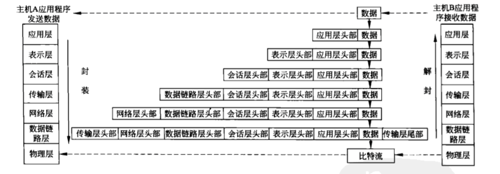
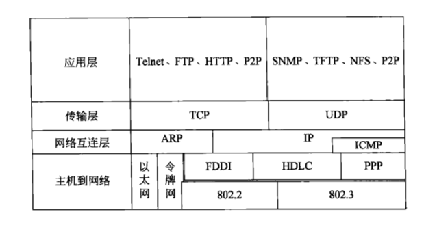
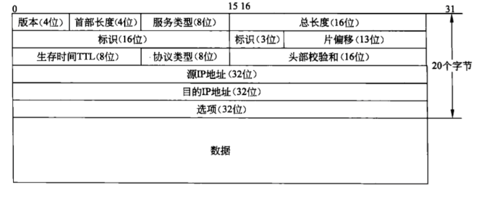
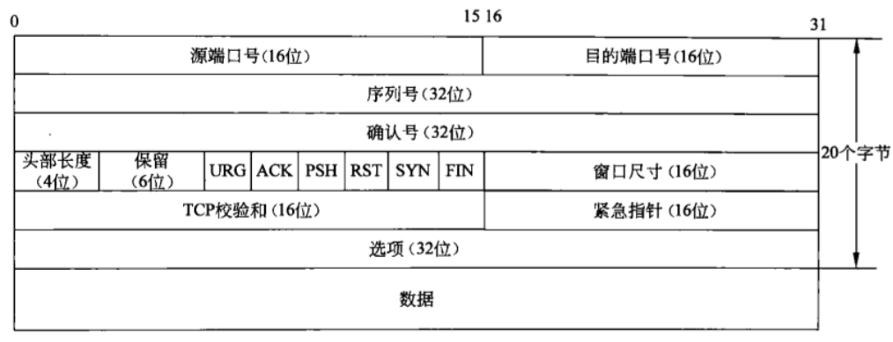
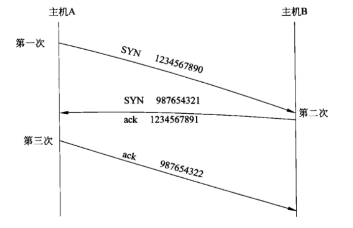
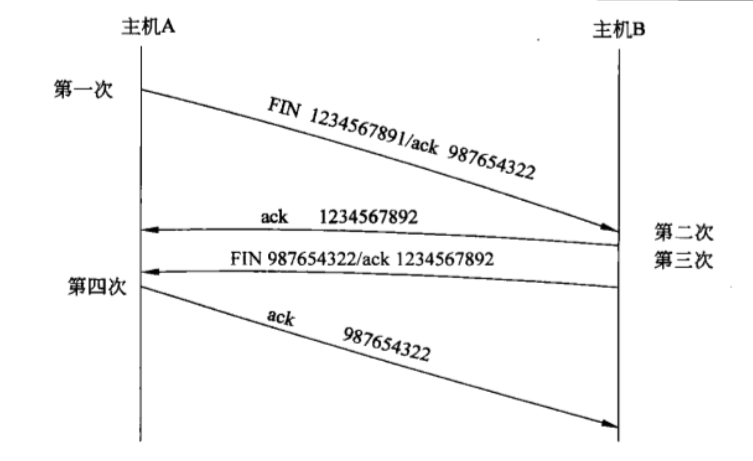
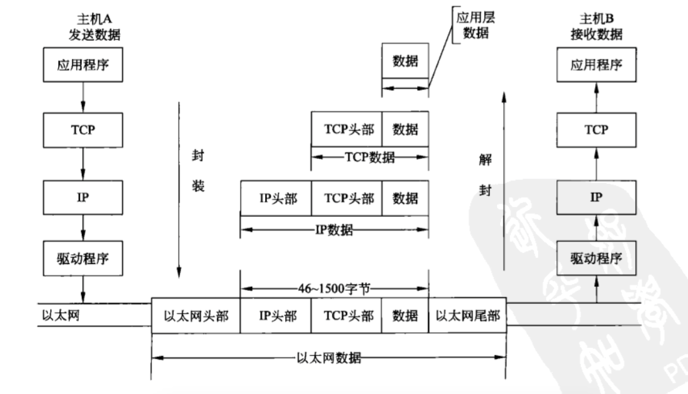
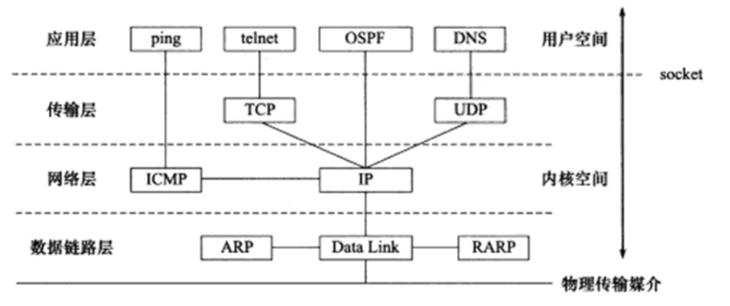

[toc]

# ISO/OSI的网络模型架构

# TCP/IP参考模型的层次结果

 

# 以太网头部结构

　　以太网属于数据链路层， 属于最基本的协议结构

 

# IP协议

　　IP协议为TCP， UDP， ICMP提供最基本的数据传输通路

 

# ICMP协议

　　ICMP协议用于传递差错信息， 时间， 回显， 网络信息等报文数据， ICMP在IP报文中的位置为：

　

各字段说明

**类型：** 占一字节，标识ICMP报文的类型，目前已定义了14种，从类型值来看ICMP报文可以分为两大类。第一类是取值为1~127的差错报文，第2类是取值128以上的信息报文。

**代码：** 占一字节，标识对应ICMP报文的代码。它与类型字段一起共同标识了ICMP报文的详细类型。

**校验和：** 这是对包括ICMP报文数据部分在内的整个ICMP数据报的校验和，以检验报文在传输过程中是否出现了差错。其计算方法与在我们介绍IP报头中的校验和计算方法是一样的。

**标识：** 占两字节，用于标识本ICMP进程，但仅适用于回显请求和应答ICMP报文，对于目标不可达ICMP报文和超时ICMP报文等，该字段的值为0。

　

通过ICMP协议， 判断局域网的某台机器是否在线的文章： 

　　linux：C语言通过ICMP局域网内部主机是否存活：http://www.cnblogs.com/diligenceday/p/6274749.html

# TCP协议

　　TCP数据在IP报文中的位置为：

　　TCP报文包含头部和数据：

> **数据偏移／首部长度**：4bits。由于首部可能含有可选项内容，因此TCP报头的长度是不确定的，报头不包含任何任选字段则长度为20字节，4位首部长度字段所能表示的最大值为1111，转化为10进制为15，15*32/8 = 60，故报头最大长度为60字节。首部长度也叫数据偏移，是因为首部长度实际上指示了数据区在报文段中的起始偏移值。　

　TCP三次握手

　　释放连接的四次握手

　　TCP数据传输过程

 

# UDP协议

　　UDP数据在IP数据中的位置

　　UDP的报文结构

　　linux：C++的socket编程：http://www.cnblogs.com/diligenceday/p/6241021.html

　　C++：C语言实现HTTP的GET和POST请求：http://www.cnblogs.com/diligenceday/p/6255788.html

 

# ARP协议

　　地址解析协议ARP的数据分段格式

　　Mac和Linux系统的：Arp欺骗源码：http://www.cnblogs.com/diligenceday/p/6246786.html

# IP/ICMP/TCP/UDP/ARP各种P的关系图

