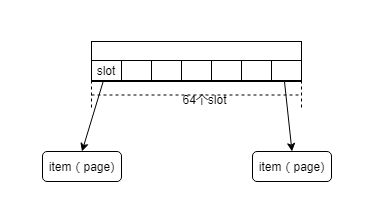
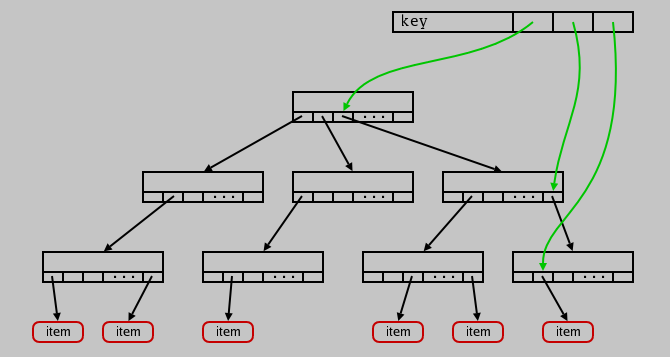
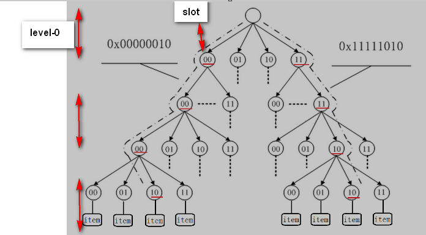

[toc]

基数树：radix tree

作用：利用radix树可以根据一个长整形（比如一个长ID）快速找到其对应的对象指针

树的单个node的格式如下：

long（32bit）分成四部分去对应每个node节点上的key，整棵树如下：

如果是一个大量的item，那么可以使用这种树，但是如果数据量比较小，那么使用一个简单的数组可以替代

这棵树是3层（2.6.16-rc)，每层用6bit去定位

> This tree is three levels deep(三层). When the kernel goes to look up a specific key, the most significant six bits will be used to find the appropriate slot in the root node（最开始的6bit去root中找到一个slot）. The next six bits then index the slot in the middle node, and the least significant six bits will indicate the slot containing a pointer to the actual value（最后的6bit找到的一个slot是一个实际的item的值）. Nodes which have no children are not present in the tree（没有child的node不会在树中呈现）

上图的另一种表示图（每个指针称为槽slot，n为划分的基的大小）

> 上图是用2bit进行的查找，**看红色划线可以看出查找过程**

> The most widespread use of radix trees, however, is in the memory management code. The `address_space` structure used to keep track of backing store contains a radix tree which tracks in-core pages tied to that mapping. Among other things, this tree allows the memory management code to quickly find pages which are dirty or under writeback.
>
> radix tree最多的是用在内存管理上，去快速的查找dirty page 和 writeback page

参考：

https://lwn.net/Articles/175432/

http://www.360doc.com/content/19/0305/18/496343_819431105.shtml

https://blog.csdn.net/feelabclihu/article/details/105743389