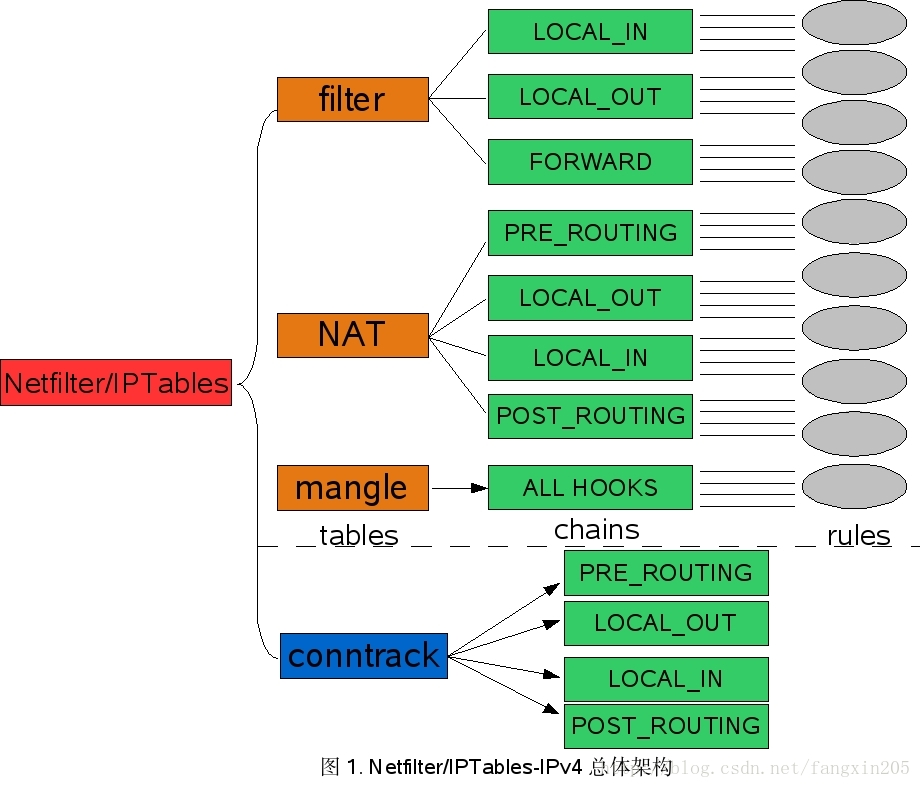
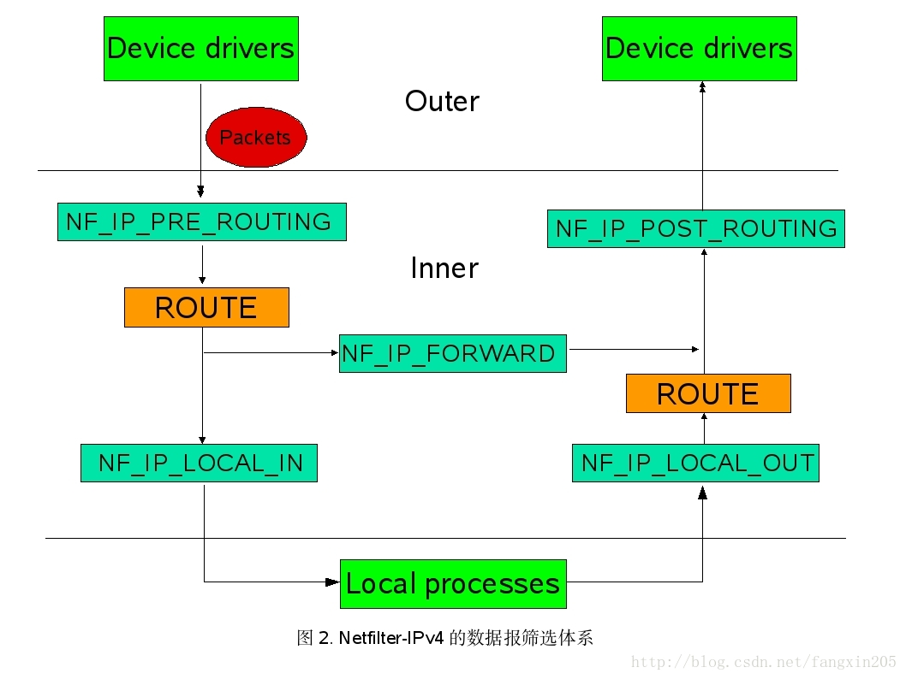
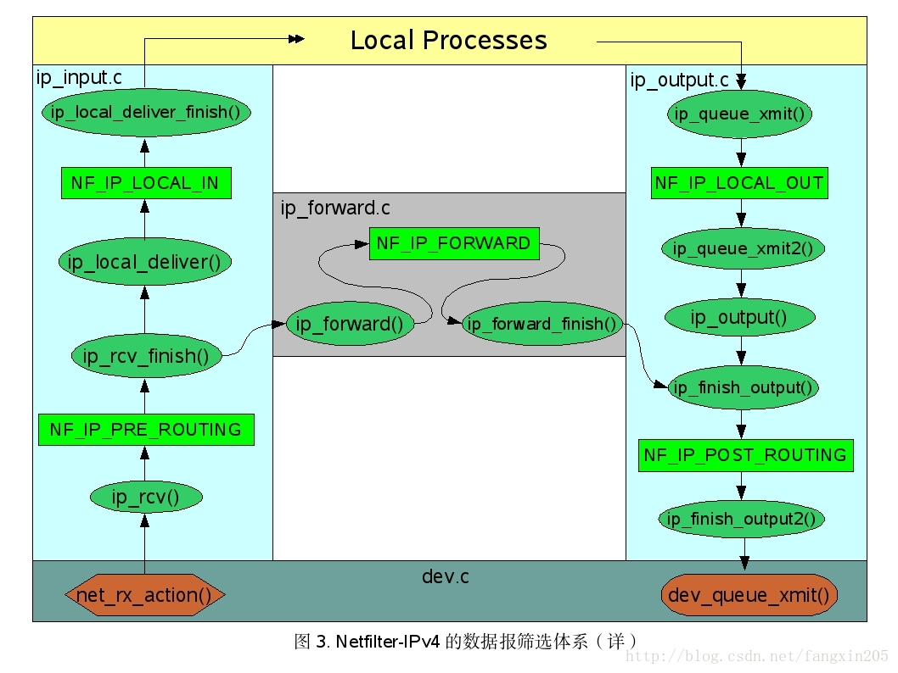
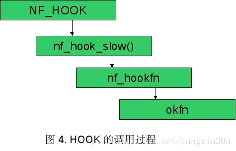

[toc]

# Netfilter源码分析详解转

https://blog.csdn.net/fangxin205/article/details/54972153


## 一、概述

**1. Netfilter/IPTables框架简介**

Netfilter/IPTables是继2.0.x的IPfwadm、2.2.x的IPchains之后，新一代的Linux防火墙机制。Netfilter采用模块化设计，具有良好的可扩充性。其重要工具模块IPTables连接到Netfilter的架构中，并允许使用者对数据报进行过滤、地址转换、处理等操作。
     Netfilter提供了一个框架，将对网络代码的直接干涉降到最低，并允许用规定的接口将其他包处理代码以模块的形式添加到内核中，具有极强的灵活性。

**2. 主要源代码文件**

- linux内核版本：2.4.21
- Netfilter主文件：net/core/netfilter.c
- Netfilter头文件：include/linux/netfilter.h
- IPv4相关：
  - c文件：net/ipv4/netfilter/*.c
  - 头文件：include/linux/netfilter_ipv4.h , include/linux/netfilter_ipv4/*.h
- IPv4协议栈主体的部分c文件，特别是与数据报传送过程有关的部分:
  - ip_input.c，ip_forward.c，ip_output.c，ip_fragment.c等

## 二、Netfilter/IPTables-IPv4总体架构

​	Netfilter主要通过表、链实现规则，可以这么说，Netfilter是表的容器，表是链的容器，链是规则的容器，最终形成对数据报处理规则的实现。详细地说，Netfilter/IPTables的体系结构可以分为三个大部分：

**1. Netfilter的HOOK机制**

```
    Netfilter的通用框架不依赖于具体的协议，而是为每种网络协议定义一套HOOK函数。这些HOOK函数在数据报经过协议栈的几个关键点时被调用，在这几个点中，协议栈将数据报及HOOK函数标号作为参数，传递给Netfilter框架。
    对于它在网络堆栈中增加的这些HOOK，内核的任何模块可以对每种协议的一个或多个HOOK进行注册，实现挂接。这样当某个数据报被传递给Netfilter框架时，内核能检测到是否有任何模块对该协议和HOOK函数进行了注册。若注册了，则调用该模块的注册时使用的回调函数，这样这些模块就有机会检查、修改、丢弃该数据报及指示Netfilter将该数据报传入用户空间的队列。
    这样，HOOK提供了一种方便的机制：在数据报通过Linux内核的不同位置上截获和操作处理数据报。
```

**2.iptables基础模块**

```
    iptables基础模块实现了三个表来筛选各种数据报，具体地讲，Linux2.4内核提供的这三种数据报的处理功能是相互间独立的模块，都基于Netfilter的HOOK函数和各种表、链实现。这三个表包括：filter表，nat表以及mangle表。
```

**3.具体功能模块**

1. 数据报过滤模块
2. 连接跟踪模块（Conntrack）
3. 网络地址转换模块（NAT）
4. 数据报修改模块（mangle）
5. 其它高级功能模块

于是，Netfilter/IPTables总体架构如下图1所示：


## 三、HOOK的实现

**1.Netfilter-IPv4中的HOOK**

```
    Netfilter模块需要使用HOOK来启用函数的动态钩接，它在IPv4中定义了五个HOOK（位于文件include/linux/netfilter_ipv4.h，Line 39），分别对应0-4的hooknum，简单地说，数据报经过各个HOOK的流程如下：
    数据报从进入系统，进行IP校验以后，首先经过第一个HOOK函数NF_IP_PRE_ROUTING进行处理；然后就进入路由代码，其决定该数据报是需要转发还是发给本机的；若该数据报是发被本机的，则该数据经过HOOK函数NF_IP_LOCAL_IN处理以后然后传递给上层协议；若该数据报应该被转发则它被NF_IP_FORWARD处理；经过转发的数据报经过最后一个HOOK函数NF_IP_POST_ROUTING处理以后，再传输到网络上。本地产生的数据经过HOOK函数NF_IP_LOCAL_OUT 处理后，进行路由选择处理，然后经过NF_IP_POST_ROUTING处理后发送出去。
    总之，这五个HOOK所组成的Netfilter-IPv4数据报筛选体系如图：（注：下面所说Netfilter/IPTables均基于IPv4，不再赘述）
```



```
详细地说，各个HOOK及其在IP数据报传递中的具体位置如图：
```



- *NF_IP_PRE_ROUTING (0)*

  ```
      数据报在进入路由代码被处理之前，数据报在IP数据报接收函数ip_rcv()（位于net/ipv4/ip_input.c，Line379）的最后，也就是在传入的数据报被处理之前经过这个HOOK。在ip_rcv()中挂接这个HOOK之前，进行的是一些与类型、长度、版本有关的检查。
      经过这个HOOK处理之后，数据报进入ip_rcv_finish()（位于net/ipv4/ip_input.c，Line306），进行查路由表的工作，并判断该数据报是发给本地机器还是进行转发。
      在这个HOOK上主要是对数据报作报头检测处理，以捕获异常情况。
      涉及功能（优先级顺序）：Conntrack(-200)、mangle(-150)、DNAT(-100)
  ```

- *NF_IP_LOCAL_IN (1)*

  ```
      目的地为本地主机的数据报在IP数据报本地投递函数ip_local_deliver()（位于net/ipv4/ip_input.c，Line290）的最后经过这个HOOK。
      经过这个HOOK处理之后，数据报进入ip_local_deliver_finish()（位于net/ipv4/ip_input.c，Line219）。
      这样，iptables模块就可以利用这个HOOK对应的INPUT规则链表来对数据报进行规则匹配的筛选了。防火墙一般建立在这个HOOK上。
      涉及功能：mangle(-150)、filter(0)、SNAT(100)、Conntrack(INT_MAX-1)
  ```

- *NF_IP_FORWARD (2)*

  ```
      目的地非本地主机的数据报，包括被NAT修改过地址的数据报，都要在IP数据报转发函数ip_forward()（位于net/ipv4/ip_forward.c，Line73）的最后经过这个HOOK。
       经过这个HOOK处理之后，数据报进入ip_forward_finish()（位于net/ipv4/ip_forward.c，Line44）
       另外，在net/ipv4/ipmr.c中的ipmr_queue_xmit()函数（Line1119）最后也会经过这个HOOK。（ipmr为多播相关，估计是在需要通过路由转发多播数据时的处理）。
       这样，IPTables模块就可以利用这个HOOK对应的FORWARD规则链表来对数据报进行规则匹配的筛选了。
       涉及功能：mangle(-150)、filter(0)
  ```

- *NF_IP_LOCAL_OUT (3)*

  ```
       本地主机发出的数据报在IP数据报构建/发送函数ip_queue_xmit()（位于net/ipv4/ip_output.c，Line339）、以及ip_build_and_send_pkt()（位于net/ipv4/ip_output.c，Line122）的最后经过这个HOOK。（在数据报处理中，前者最为常用，后者用于那些不传输有效数据的SYN/ACK包）。
       经过这个HOOK处理后，数据报进入ip_queue_xmit2()（位于net/ipv4/ip_output.c，Line281）。
       另外，在ip_build_xmit_slow()（位于net/ipv4/ip_output.c，Line429）和ip_build_xmit()（位于net/ipv4/ip_output.c，Line638）中用于进行错误检测；在igmp_send_report()（位于net/ipv4/igmp.c，Line195）的最后也经过了这个HOOK，进行多播时相关的处理。
       这样，IPTables模块就可以利用这个HOOK对应的OUTPUT规则链表来对数据报进行规则匹配的筛选了。
       涉及功能：Conntrack(-200)、mangle(-150)、DNAT(-100)、filter(0)
  ```

- *NF_IP_POST_ROUTING (4)*

  ```
       所有数据报，包括源地址为本地主机和非本地主机的，在通过网络设备离开本地主机之前，在IP数据报发送函数ip_finish_output()（位于net/ipv4/ip_output.c，Line184）的最后经过这个HOOK。
       经过这个HOOK处理后，数据报进入ip_finish_output2()（位于net/ipv4/ip_output.c，Line160）另外，在函数ip_mc_output()（位于net/ipv4/ip_output.c，Line195）中在克隆新的网络缓存skb时，也经过了这个HOOK进行处理。
       涉及功能：mangle(-150)、SNAT(100)、Conntrack(INT_MAX)
       其中，入口为net_rx_action()（位于net/core/dev.c，Line1602），作用是将数据报一个个地从CPU的输入队列中拿出，然后传递给协议处理例程。
       出口为dev_queue_xmit()（位于net/core/dev.c，Line1035），这个函数被高层协议的实例使用，以数据结构struct sk_buff *skb的形式在网络设备上发送数据报。
  ```

**2.HOOK的调用**

```
    HOOK的调用是通过宏NF_HOOK实现的，其定义位于include/linux/netfilter.h，Line122：
1
#define NF_HOOK(pf, hook, skb, indev, outdev, okfn) /
(list_empty(&nf_hooks[(pf)][(hook)])    /
? (okfn)(skb)   /
: nf_hook_slow((pf), (hook), (skb), (indev), (outdev), (okfn)))1234
    这里先调用list_empty函数检查HOOK点存储数组nf_hooks是否为空，为空则表示没有HOOK注册，则直接调用okfn继续处理。如果不为空，则转入nf_hook_slow()函数。
    nf_hook_slow()函数（位于net/core/netfilter.c，Line449）的工作主要是读nf_hook数组遍历所有的nf_hook_ops结构，并调用nf_hookfn()处理各个数据报。
    即HOOK的调用过程如图:
```



```
下面说明一下NF_HOOK的各个参数：
```

- pf：协议族标识，相关的有效协议族列表位于include/linux/socket.h，Line 178。对于IPv4，应该使用协议族PF_INET；

- hook：HOOK标识，即前面所说5个HOOK对应的hooknum；

- skb：是含有需要被处理包的sk_buuff数据结构的指针。sk_buff是Linux网络缓存，指那些linux内核处理IP分组报文的缓存，即套接字缓冲区。

  ```
      网卡收到IP分组报文后，将它们放入sk_buff，然后再传送给网络堆栈，网络堆栈几乎一直要用到sk_buff。其定义在include/linux/skbuff.h，Line 129，下面列出我认为对分析有意义的部分成员：
  ```

  - ’struct sock *sk;’：指向创建分组报文的socket；
  - ‘struct timeval stamp;’：分组报文到达系统的时间；
  - 下面是三个union，存放的是各层中各种协议的报文头指针：
    \- h对应传输层的报头
    \- nh对应网络层的报头
    \- mac对应MAC层的报头
  - ‘unsigned int len;’：套接字缓存所代表的报文长度，即从`unsigned char *data;`的位置算起的当前有效报文长度。
  - ‘unsigned char pkt_type;’：表示报文的类型，具体类型定义在include/linux/if_packet.h，Line24：

```
#define PACKET_HOST     0       /* To us 发送到本机的报文*/
#define PACKET_BROADCAST    1       /* To all   广播报文    */
#define PACKET_MULTICAST    2       /* To group  多播报文   */
#define PACKET_OTHERHOST    3       /* To someone else 表示目的地非本机但被本机接收的报文 */
#define PACKET_OUTGOING     4       /* Outgoing of any type 离开本机的报文 */
/* These ones are invisible by user level */
#define PACKET_LOOPBACK     5       /* MC/BRD frame looped back  本机发给自己的报文*/
#define PACKET_FASTROUTE    6       /* Fastrouted frame 快速路由报文 */12345678
```

- indev：输入设备，收到数据报的网络设备的net_device数据结构指针，即数据报到达的接口。
  - 用于NF_IP_PRE_ROUTING和NF_IP_LOCAL_IN两个HOOK
- outdev：输出设备，数据报离开本地所要使用的网络设备的net_device数据结构指针。
  - 用于NF_IP_LOCAL_OUT和NF_IP_POST_ROUTING两个HOOK
  - 注意：在通常情况下，在一次HOOK调用中，indev和outdev中只有一个参数会被使用
- okfn：下一步要处理的函数。即如果有HOOK函数，则处理完所有的HOOK函数，且所有向该HOOK注册过的筛选函数都返回NF_ACCEPT时，调用这个函数继续处理；如果没有注册任何HOOK，则直接调用此函数。其5个参数将由宏NF_HOOK传入。

**3. HOOK点的实现**

```
     对应于各个不同协议的不同HOOK点是由一个二维数组nf_hooks存储的（位于net/core/netfilter.c，Line 47），具体的HOOK点则由数据结构nf_hook_ops（位于include/linux/netfilter.h，Line 44）实现。如图:
```


```
其中，nf_hook_ops成员中：
```

- int priority;` priority值越小，优先级越高，相关优先级在include/linux/netfilter_ipv4.h，Line52中枚举定义：

```
enum NF_IP_hook_priorities {
    NF_IP_PRI_FIRST = INT_MIN,
    NF_IP_PRI_CONNTRACK= -200,
    NF_IP_PRI_MANGLE = -150,
    NF_IP_PRI_NAT_DST = -100,
    NF_IP_PRI_FILTER = 0,
    NF_IP_PRI_NAT_SRC = 100,
    NF_IP_PRI_LAST = INT_MAX,
}
```

- ‘nf_hookfn *hook;’：为处理函数的指针，其函数指针类型定义位于include/linux/netfilter.h，Line38，为：

```
typedef unsigned int nf_hookfn(unsigned int hooknum,
                   struct sk_buff *skb,
                   const struct net_device *in,
                   const struct net_device *out,
                   int (*okfn)(struct sk_buff *));12345
 这是nf_hook_ops中最关键的成员，其五个参数分别对应前面所解释的NF_HOOK中第2到6个参数。调用HOOK的包筛选函数必须返回特定的值，这些值以宏的形式定义于头文件include/linux/netfilter.h中（Line15），分别为：
```

- - NF_DROP(0)：丢弃此数据报，禁止包继续传递，不进入此后的处理流程；
  - NF_ACCEPT(1)：接收此数据报，允许包继续传递，直至传递到链表最后，而进入okfn函数；
    - 以上两个返回值最为常见
  - NF_STOLEN(2)：数据报被筛选函数截获，禁止包继续传递，但并不释放数据报的资源，这个数据报及其占有的sk_buff仍然有效（e.g. 将分片的数据报一一截获，然后将其装配起来再进行其他处理）；
  - NF_QUEQUE(3)：将数据报加入用户空间队列，使用户空间的程序可以直接进行处理；
    - 在nf_hook_slow()以及nf_reinject()函数（位于net/core/netfilter.c，Line449，Line505）中，当由调用nf_iterate()函数（位于net/core/netfilter.c，Line339，作用为遍历所有注册的HOOK函数，并返回相应的NF_XX值）而返回的verdict值为NF_QUEUE时（即当前正在执行的这个HOOK筛选函数要求将数据报加入用户空间队列），会调用nf_queue()函数（位于net/core/netfilter.c，Line407）
    - nf_queue()函数将这个数据报加入用户空间队列nf_info（位于include/linux/netfilter.h，Line77），并保存其设备信息以备用
  - NF_REPEAT(4)：再次调用当前这个HOOK的筛选函数，进行重复处理。

**4. HOOK的注册和注销**

```
    HOOK的注册和注销分别是通过nf_register_hook()函数和nf_unregister_hook()函数（分别位于net/core/netfilter.c，Line60，76）实现的，其参数均为一个nf_hook_ops结构，二者的实现也非常简单。
    nf_register_hook()的工作是首先遍历nf_hools[][]，由HOOK的优先级确定在HOOK链表中的位置，然后根据优先级将该HOOK的nf_hook_ops加入链表；
    nf_unregister_hook()的工作更加简单，其实就是将该HOOK的nf_hook_ops从链表中删除。
```

## 四、iptables系统

**1. 表－规则系统**

```
    IPTables是基于Netfilter基本架构实现的一个可扩展的数据报高级管理系统，利用table、chain、rule三级来存储数据报的各种规则。系统预定义了三个table：
```

- filter：数据报过滤表（文件net/ipv4/netfilter/iptable_filter.c）

  ```
      监听NF_IP_LOCAL_IN、NF_IP_FORWARD和NF_IP_LOCAL_OUT三个HOOK，作用是在所有数据报传递的关键点上对其进行过滤。
  ```

- nat：网络地址转换表

  ```
      监听NF_IP_PRE_ROUTING、NF_IP_POST_ROUTING和NF_IP_LOCAL_OUT三个HOOK，作用是当新连接的第一个数据报经过时，在nat表中决定对其的转换操作；而后面的其它数据报都将根据第一个数据报的结果进行相同的转换处理。
  ```

- mangle：数据报修改表（位于net/ipv4/netfilter/iptable_mangle.c）

