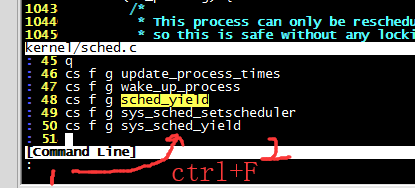

[TOC]


转自：https://blog.csdn.net/Listening_music/article/details/7428940

# vim目录结构说明

```shell
#如果没有这些目录就自己创建
~/.vim/plugin
~/.vim/doc
~/.vim/syntax
~/.vimrc   #file

```


# vim编程常用命令

| 快捷键 | description                                      |
| ------ | ------------------------------------------------ |
| %      | 跳转到配对的括号去，多按几次可以来回切换         |
| [[     | 跳转到代码块的开头去（要求代码块中{ 单独占一行） |
|        |                                                  |
|        |                                                  |
|        |                                                  |
|        |                                                  |
|        |                                                  |


# 需要安装的依赖

## ctags install

```shell
#download： https://sourceforge.net/projects/ctags/files/ctags/5.6/

tar zxvf ctags-5.8.tar.gz 
cd ctags-5.8
#一定要执行，网上哪些没有这步，后面make报错
./configure 
make
make install
#查看是否安装成功
which ctags
```

让后进入到源码目录中（如果源码是多层，就去最上层的目录）,执行`ctags -R`，此时就会在该目录下生成一个车tags目录

## 快捷键

```shell
#光标自动跳转到setmouse()函数的定义处
<C-]>

#跳回到上一次的位置
<C-t>

```

自动补全

```shell
# 自动补齐CTRL+N/CTRL+P

#单词自动补全：(常用)
CTRL+n ：当你输入第一个字母的时候，再CTRL+n，自动出现下拉菜单，单词默认选中第一个，继续CTRL+n，CTRL+p可以上下切换，或者用方向键（太慢）
CTRL+p ：同上，只是默认的选中的是列表中最后一个单词

#行自动补全：
CTRL+x CTRL+l (l指小写的L )：两个命令组合使用。在插入模式下输入已经存在行的第一个单词，再按这两个键，就会列出该整行出来

#文件名自动补全：
CTRL+x CTRL+f ：插入模式下，按这两个组合键，可以插入当前目录下的文件名。处用在哪里呢，当然是有时候我们要指定默认执行文件的路径，这样就方便啦。

#字典补全：
#首先在~/.vimrc加入如下代码，注意这是在Linux，windows下应该是C:\Users\$username(用户名）

set dictionary-=$VIM/dic.txt dictionary+=$VIM/dic.txt

dic.txt中的单词一每行一个单词来分割的
CTRL+x CTRL+k 就能看到dic.txt中定义的单词的，如果你还麻烦，想直接CTRL+n就显示其中的列表的话，再配置一下.vimrc文件：

set complete-=k complete+=k
```


# vim使用手册--找到 tag：1/3 或更多


我们在vim中加载了ctag+taglist+winmanager后

我们在关联一个函数或者一个变量定义的时候，经常有多处地方定义了相同名字，需要定位正确的定义地方。

```shell
：ts 或 tselect 查看有相同地方的定义
：tn或tnext   查找下一个定义地方。
：tp   查找上一个地方。
：tfirst  到第一个匹配
：tlast 到最后一个匹配
```

还有一种方式如下：

`g+]` 列出所有的匹配项，如下


输入`q`+前面的数字，进入指定的文件，j,k可以实现上下分页


# Cscope插件

https://blog.csdn.net/Listening_music/article/details/7428940

## install

````shell
 yum install -y cscope
 
 #如果是编译安装，那么会报错，解决如下：
 yum install ncurses-devel -y 
````

## 生成cscope的数据库文件

```shell
cscope -Rbkq

#但是这里生成的文件在当前目录的上一层目录，不知道为啥？

建立cscope使用的索引文件
         1. 在你需要浏览源码的根目录下（如你想用cscope看linux源码)使用下面命令：
         2.    * #: cscope -Rbkq<回车>
         3. R 表示把所有子目录里的文件也建立索引
         4. b 表示cscope不启动自带的用户界面，而仅仅建立符号数据库
         5. q生成cscope.in.out和cscope.po.out文件，加快cscope的索引速度
         6. k在生成索引文件时，不搜索/usr/include目录
```


## 配置

```shell
"-- Cscope setting --
" 添加cscope数据库到当前vim
if has("cscope")
    set csprg=/bin/cscope " 指定用来执行cscope的命令
    set csto=0 " 设置cstag命令查找次序：0先找cscope数据库再找标签文件；1先找标签文件再找cscope数据库
    set cst " 同时搜索cscope数据库和标签文件
    set cscopequickfix=s-,c-,d-,i-,t-,e- " 使用QuickFix窗口来显示cscope查找结果
    set nocsverb
    " 这里写死了，直接写的是源码的目录
    cs add /home/cys/cscope.out /home/cys/linux-5.7
    set csverb
endif
```


## cscope 结果输出到 quickfix窗口


在$HOME/.vimrc下追加如下一行：

```shell
set cscopequickfix=s-,c-,d-,i-,t-,e-

+ 表示显示结果必须追加到quickfix窗口。
- 隐含着清空先前的的显示结果。
0 表示不使用quickfix窗口。
默认不使用quickfix窗口。
```

> 注意：如果有多个匹配项，cscope会弹出窗口显示多个匹配项，输入数字即可跳转到对应匹配项。而设置cscope结果输出到quickfix后，cscope只会显示第一个匹配项，如果想要查看其它匹配项，需要输入cw，进入quickfix的窗口进行查看。

## 

```shell
0或者s   —— 查找这个C符号

1或者g  —— 查找这个定义

2或者d  —— 查找被这个函数调用的函数（们）

3或者c  —— 查找调用这个函数的函数（们）

4或者t   —— 查找这个字符串

6或者e  —— 查找这个egrep匹配模式

7或者f   —— 查找这个文件

8或者i   —— 查找#include这个文件的文件（们）


#在vim中，使用如下：比如查找某一个函数的定义
：cs find g fn_name  


#查找历史
： + (ctrl+F) ; 然后就可以jkl翻页查看历史
```



