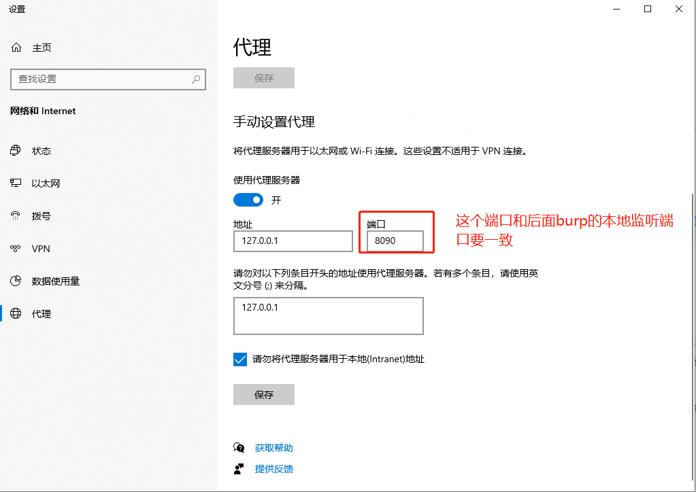

[toc]

# PC设置代理

# burp设置代理

# burp拦截&放行

拦截之后，可以在这里修改数据包，然后将**intercept is on** , 设置为off，就放行了，当然也可以使用下面的步骤在history中修改并重放

# burp-http包数据修改并重放

http-history中可以看到所有的拦截的http请求

右键某一个请求，将其添加到【Repeater】中

然后重放：在【Repeater】中找到对应的URL，点击send，当然在修改之前可以修改数据包的格式

